

  [![MIT License][license-shield]][license-url]
  [![Size][size-shield]][size-url]
  [![Issues][issues-shield]][issues-url]
  [![Downloads][downloads-shield]][downloads-url]
  [![Stars][stars-shield]][stars-url]\
  [![C][c-shield]][c-url]
  [![C++][cpp-shield]][cpp-url]
  [![VS][vs-shield]][vs-url]
  [![Blender][blender-shield]][blender-url]

  # Principles of Computer Graphics M
  Repository for my laboratory solutions for the [Principles of Computer Graphics M](https://www.unibo.it/en/teaching/course-unit-catalogue/course-unit/2022/468044) course.\
  **NB**: reports are written in Italian.

  [Guidelines](./tracce)
  ·
  [Reports](./reports)
  ·
  [VS Solution](./laboratorio)
  ·
  [Download](https://github.com/mikyll/Fondamenti-di-Computer-Graphics-M/releases/latest)
  ·
  [Italian <kbd></kbd>](./README.it.md)
    

## Setup
Check [setup.md](./setup.md) for setup guidelines for VS projects.

## Report Template
You can find a LaTeX template for the reports [here](./reports/templates/FCG-M%20lab%20template%20(EN)).

## Laboratory

### Lab00 - OpenGL Introduction
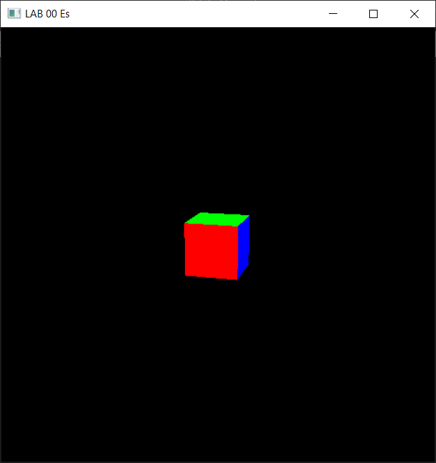 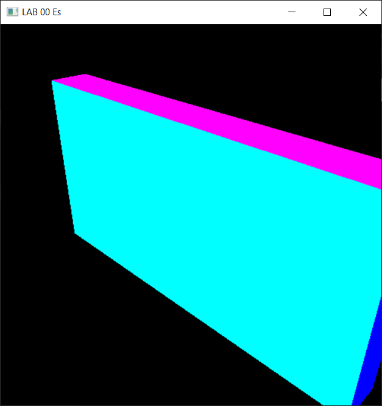

<a href="./tracce/lab_00_doc.pdf">Guidelines</a>
·
<a href="./reports/lab00 Michele Righi.pdf">Report</a>
·
<a href="./laboratorio/00es/">Code</a>
·
<a href="https://github.com/mikyll/Fondamenti-di-Computer-Graphics-M/releases/download/v1.0/lab00_Windows_x64.zip">Download (Win64)</a>
 
 

### Lab01 - Bézier Curves in OpenGL
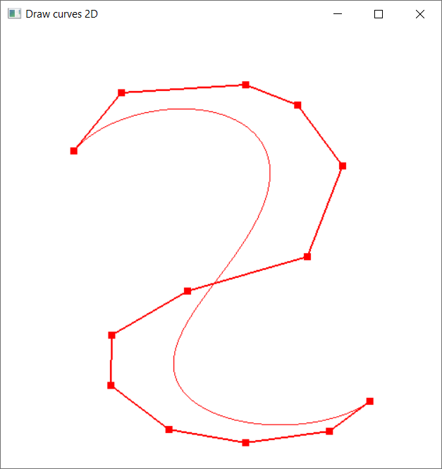 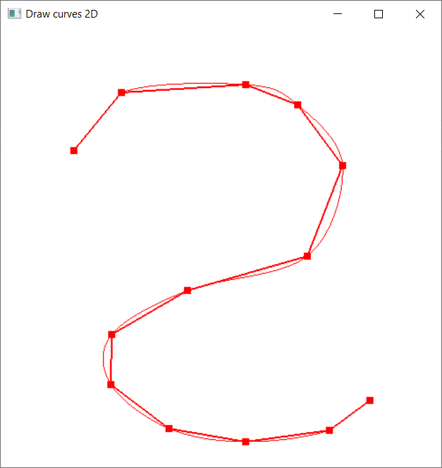

<a href="./tracce/lab_01_doc.pdf">Guidelines</a>
·
<a href="./reports/lab01 Michele Righi.pdf">Report</a>
·
<a href="./laboratorio/01es/">Code</a>
·
<a href="https://github.com/mikyll/Fondamenti-di-Computer-Graphics-M/releases/download/v1.0/lab01_Windows_x64.zip">Download (Win64)</a>
 
 

### Lab02 - 2D Animation & Gameplay in OpenGL
https://github.com/mikyll/Fondamenti-di-Computer-Graphics-M/assets/56556806/7ae7ba52-1bc4-4348-8198-17460bb7c5ea

<a href="./tracce/lab_02_doc.pdf">Guidelines</a>
·
<a href="./reports/lab02 Michele Righi.pdf">Report</a>
·
<a href="./laboratorio/02es/">Code</a>
·
<a href="https://github.com/mikyll/Fondamenti-di-Computer-Graphics-M/releases/download/v1.0/lab02_Windows_x64.zip">Download (Win64)</a>
 
 

### Lab03 - Mesh, Shading and Lighting in OpenGL
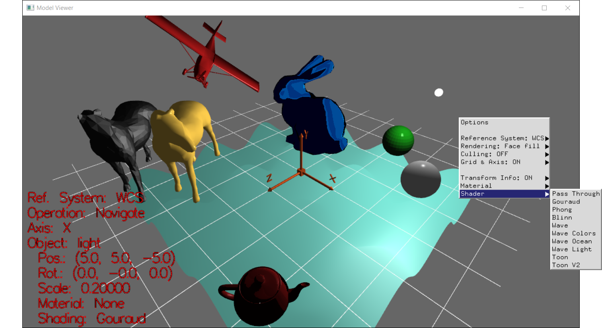

<a href="./tracce/lab_03_doc.pdf">Guidelines</a>
·
<a href="./reports/lab03 Michele Righi.pdf">Report</a>
·
<a href="./laboratorio/03es/">Code</a>
·
<a href="https://github.com/mikyll/Fondamenti-di-Computer-Graphics-M/releases/download/v1.0/lab03_Windows_x64.zip">Download (Win64)</a>
 
 

### Lab04 - Raytracing in OpenGL
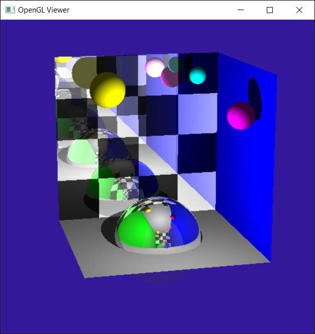 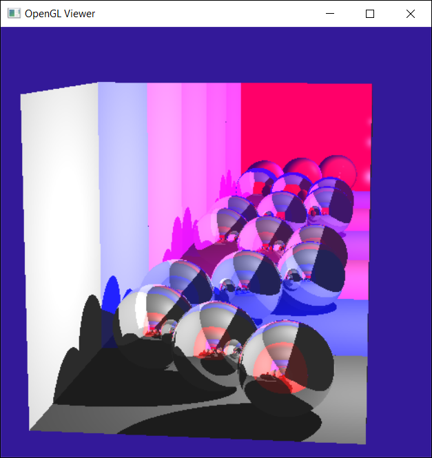

<a href="./tracce/lab_04_doc.pdf">Guidelines</a>
·
<a href="./reports/lab04 Michele Righi.pdf">Report</a>
·
<a href="./laboratorio/04es/">Code</a>
·
<a href="https://github.com/mikyll/Fondamenti-di-Computer-Graphics-M/releases/download/v1.0/lab04_Windows_x64.zip">Download (Win64)</a>
 
 

### Lab05 - Modeling in Blender
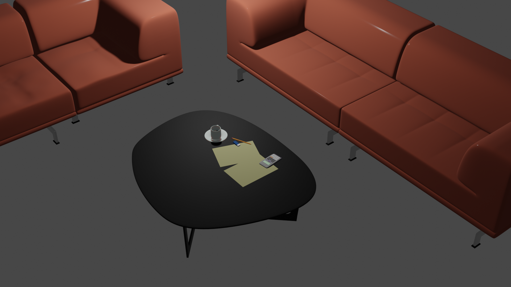
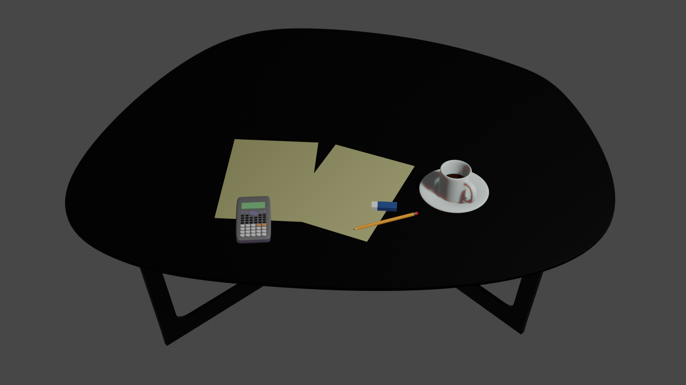

<a href="./tracce/lab_05_doc.pdf">Guidelines</a>
·
<a href="./reports/lab05 Michele Righi.pdf">Report</a>
·
<a href="https://github.com/mikyll/Fondamenti-di-Computer-Graphics-M/releases/download/v1.0/lab05.blend">Download Scene</a>
 
 

### Lab06 - Digital Art in Blender
#### Cycles Full HD
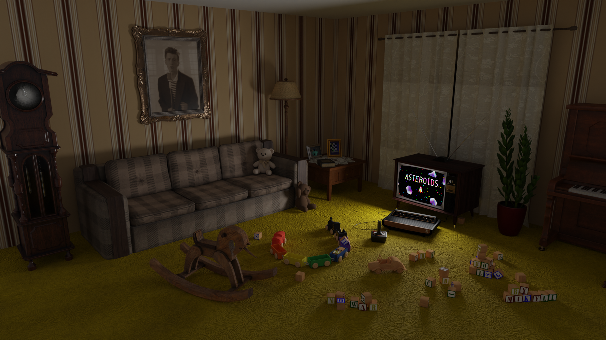

#### Eevee Full HD (No Irradiance Volume)
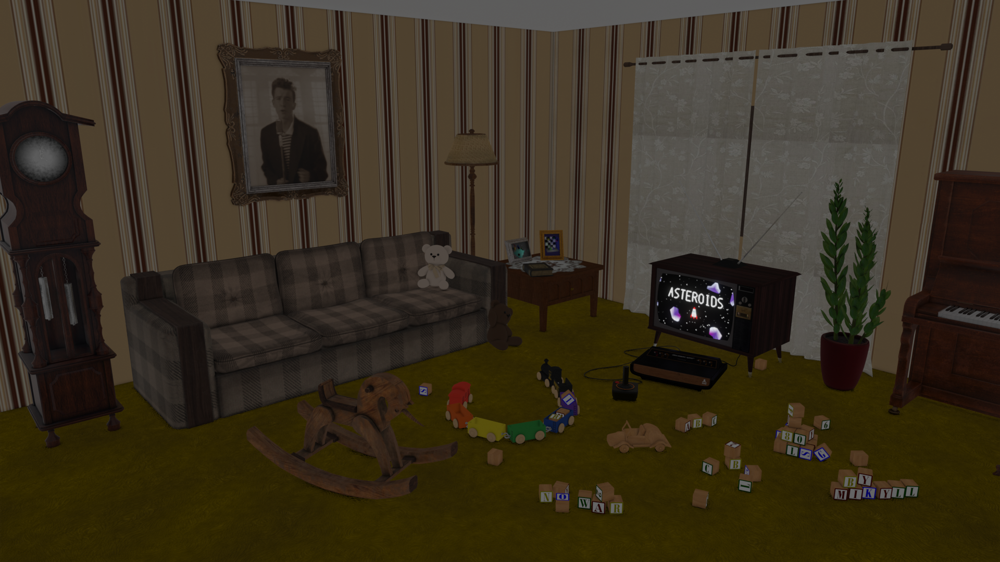

#### Eevee Full HD (Irradiance Volume x25)
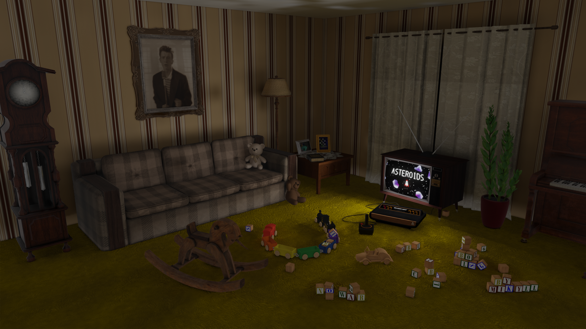

<a href="./tracce/lab_06_doc.pdf">Traccia</a>
·
<a href="./reports/lab06 Michele Righi.pdf">Report</a>
·
<a href="https://github.com/mikyll/Fondamenti-di-Computer-Graphics-M/releases/download/v1.0/lab06.blend">Download Scene</a>
·
<a href="https://github.com/mikyll/Fondamenti-di-Computer-Graphics-M/releases/latest">Download Pictures</a>
 
 

### Lab07 - Shading: Texture, Normal, Environmental Mapping and Refraction in OpenGL 

*Future development*

<a href="./tracce/lab_07_doc.pdf">Guidelines</a>
·
<a href="./reports/lab07 Michele Righi.pdf">Report (TO-DO)</a>
·
<a href="./laboratorio/04es/">Code (TO-DO)</a>
·
<a href="">Download (TO-DO)</a>
 
 

[downloads-shield]: https://img.shields.io/github/downloads/mikyll/Fondamenti-di-Computer-Graphics-M/total
[downloads-url]: https://github.com/mikyll/Fondamenti-di-Computer-Graphics-M/releases/latest
[license-shield]: https://img.shields.io/github/license/mikyll/Fondamenti-di-Computer-Graphics-M
[license-url]: https://github.com/mikyll/Fondamenti-di-Computer-Graphics-M/blob/main/LICENSE
[size-shield]: 	https://img.shields.io/github/repo-size/mikyll/Fondamenti-di-Computer-Graphics-M
[size-url]: https://github.com/mikyll/Fondamenti-di-Computer-Graphics-M
[issues-shield]: https://img.shields.io/github/issues/mikyll/Fondamenti-di-Computer-Graphics-M
[issues-url]: https://github.com/mikyll/Fondamenti-di-Computer-Graphics-M/issues
[stars-shield]: https://custom-icon-badges.herokuapp.com/github/stars/mikyll/Fondamenti-di-Computer-Graphics-M?logo=star&logoColor=yellow&style=flat
[stars-url]: https://github.com/mikyll/Fondamenti-di-Computer-Graphics-M/stargazers

[c-shield]: https://img.shields.io/badge/C-%2300599C.svg?logo=c&logoColor=white
[c-url]: https://www.open-std.org/jtc1/sc22/wg14/
[cpp-shield]: https://img.shields.io/badge/C++-%2300599C.svg?logo=c%2B%2B&logoColor=white
[cpp-url]: https://isocpp.org/
[vs-shield]: https://img.shields.io/badge/Visual%20Studio-5C2D91.svg?logo=visual-studio&logoColor=white
[vs-url]: https://code.visualstudio.com/
[blender-shield]: https://img.shields.io/badge/Blender-%23F5792A.svg?logo=blender&logoColor=white
[blender-url]: https://www.jetbrains.com/idea/ 
